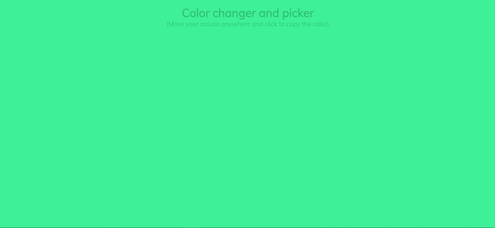
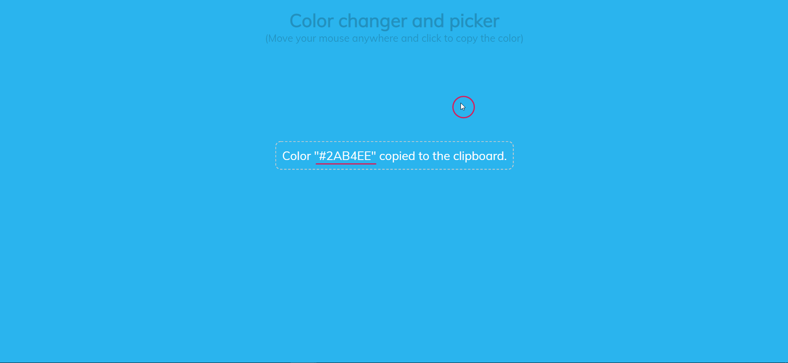

# Color changer and picker

This is a simple color changing screen that changes color with cursor movement.

To see different colors just move your cursor on the screen and whenever you like a certain color, click at that spot to copy the color in hex mode to the cliboard.

